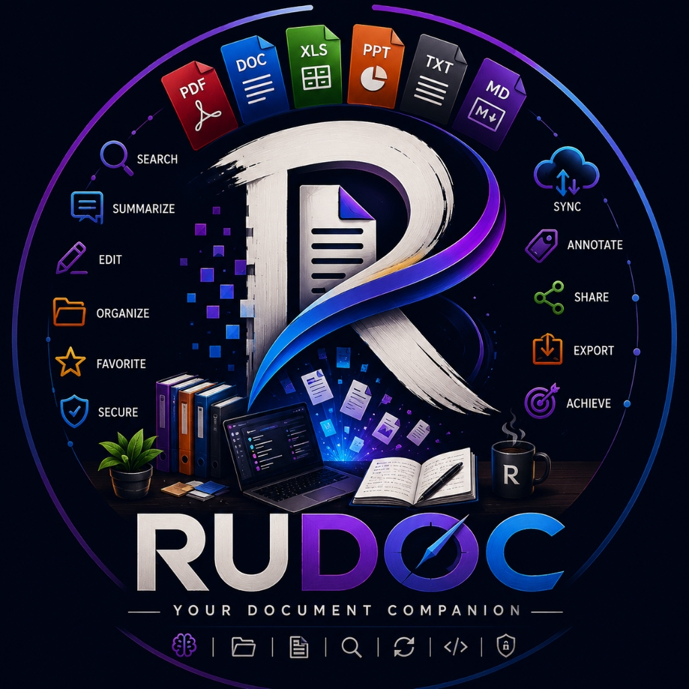

<div align="center">
  
  <h1>RUDOC 🇮🇳</h1>
  <p><strong>Smart Document Readiness & Citizen Service Gap Analysis Assistant</strong></p>
  <p><em>Your Intelligent Document & College Admission Companion</em></p>
</div>

RUDOC is a digital assistant designed to help applicants (students, job seekers, and citizens) navigate complex documentation requirements for Indian government portals, competitive admissions, and welfare schemes.

Instead of facing last-minute rejections due to missing documents or minor name/DOB spelling discrepancies, RUDOC audits your document vault, flags mismatch risks, and generates an actionable procurement checklist with official portal links.

---

## 🌟 Standout & Unique Features

### 1. 🔍 Cross-Document Identity & Spelling Mismatch Detector (*Killer Feature*)
* **The Problem:** Up to 35% of college and government applications in India get rejected due to subtle spelling differences (e.g. *Rahul Kumar* vs *Rahul Kr* vs *Rahul Sharma*) or conflicting Date of Birth (DOB) across Aadhaar, PAN, and 10th Marksheets.
* **The Solution:** RUDOC automatically performs pairwise Levenshtein similarity cross-audits across all vault documents, computes consistency confidence scores, and gives actionable advice on how to rectify discrepancies before official submission.

### 2. 🎯 Smart Service Requirement & Synonym Matcher
* Understands document equivalencies and alternatives (e.g. *Identity Proof* is satisfied by *Aadhaar*, *PAN*, *Passport*, or *Voter ID*; *Class 10 Certificate* maps to *10th Marksheet*).
* Computes live readiness percentages (`0%` to `100%`) for target applications.

### 3. 🔐 Encrypted Document Vault with Instant Metadata Extraction
* Manage essential documents (Aadhaar, PAN, 10th/12th Marksheets, Domicile, Income & Caste Certificates).
* Displays OCR verification status, confidence meters, issuing authority, and doc numbers.

### 4. 📋 Dynamic Action Checklist & Procurement Guides
* Automatically translates missing documents into prioritized tasks (*High*, *Medium*, *Low*).
* Provides direct step-by-step guidance on how and where to apply (e.g., State e-District, UIDAI Kendra, DigiLocker).
* Track status with interactive toggles (*Not Started* ➔ *In Progress* ➔ *Completed*).

### 5. 📄 Printable Application Readiness Audit Report
* One-click generation of an official application summary report with ready/missing lists, mismatch audit status, and portal links for offline reference or printing.

---

## 🛠️ Tech Stack & Architecture

| Layer | Technology | Description |
| :--- | :--- | :--- |
| **Frontend** | React 19 + Vite | Component-driven SPA with glassmorphism UI & responsive CSS |
| **Backend** | Node.js HTTP Server | RESTful API with fast JSON routing and in-memory store |
| **Linting & Quality**| Oxlint | High-speed linting and code quality validation |
| **Algorithms** | Levenshtein String Similarity | Cross-document fuzzy matching & discrepancy detection |

### Project Directory Structure

```text
RUDOC/
├── backend/                  # Node.js REST API
│   ├── data.js               # Service definitions, guides, and demo vault data
│   ├── server.js             # API server, mismatch audit engine, match logic
│   └── package.json
├── frontend/                 # React + Vite Client
│   ├── src/
│   │   ├── components/       # Modular UI components (Navbar, Sidebar, MismatchDetector, Modals)
│   │   ├── pages/            # Page views (Overview, Services, Vault, Tasks, Guide)
│   │   ├── App.jsx           # Main orchestrator & state manager
│   │   ├── App.css           # Global design system & animations
│   │   └── main.jsx
│   └── package.json
├── docs/                     # API and architecture documentation
├── database/                 # Reserved for persistent SQL/NoSQL storage
└── README.md
```

---

## 🚀 Quickstart & Setup

### 1. Start the Backend API (Port 4000)

```bash
cd backend
npm run dev
```

### 2. Start the React Frontend (Port 5173)

```bash
cd frontend
npm run dev
```

Open your browser at **`http://127.0.0.1:5173`**.

---

## 📡 API Endpoints

| Method | Endpoint | Description |
| :--- | :--- | :--- |
| `GET` | `/api/health` | Service health and version status |
| `GET` | `/api/overview` | Overall dashboard metrics, stats, and audit summary |
| `GET` | `/api/services` | List of all supported academic and government services |
| `GET` | `/api/user/documents` | Retrieve user's document vault and profile |
| `POST` | `/api/user/documents` | Upload/add a verified document to the vault |
| `DELETE`| `/api/user/documents/:id`| Remove a document from the vault |
| `GET` | `/api/match/:serviceId` | Smart readiness match calculation for a target service |
| `GET` | `/api/tasks/:serviceId` | Fetch action checklist for a service |
| `POST` | `/api/tasks/:serviceId` | Generate prioritized missing document tasks |
| `PATCH`| `/api/tasks/:serviceId/:taskId` | Update task status (`Not Started` / `In Progress` / `Completed`) |
| `GET` | `/api/audit/mismatches` | Run cross-document name/DOB discrepancy analysis |

---

## 🛡️ Important Safety & Privacy Notice

> **RUDOC is an independent citizen preparation assistant.** It is not an official government agency and does not claim direct access to official government databases. Users are guided toward verified official portals (e.g. `uidai.gov.in`, `scholarships.gov.in`, `passportindia.gov.in`). Always verify final eligibility on official platforms.

---

## 🗺️ Future Roadmap

- [x] Cross-Document Name & DOB Mismatch Detector
- [x] Smart Synonym & Equivalent Document Matcher
- [x] Exportable Printable Application Readiness Report
- [ ] Client-side Tesseract OCR text extraction from uploaded images/PDFs
- [ ] User authentication with JWT & SQLite/PostgreSQL persistence
- [ ] WhatsApp/SMS deadline reminders for scholarship and admission dates
- [ ] Multi-lingual support (Hindi, Marathi, Tamil, Bengali, Telugu)

---

## 📄 License

MIT License © 2026 RUDOC Team.
